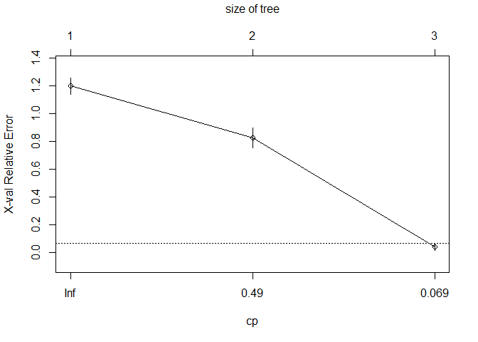
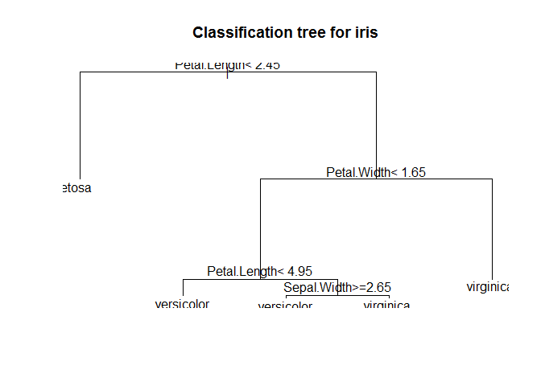
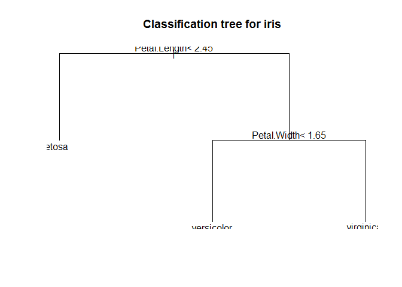

Decision Tree
================

### Divid Data

``` r
library(caret)
```

    ** Loading required package: lattice

    ** Loading required package: ggplot2

``` r
idx <- createDataPartition(iris$Species, p=.7, list=F)
train <- iris[idx,]
test <- iris[-idx,]
table(train$Species)
```

    ** 
    **     setosa versicolor  virginica 
    **         35         35         35

### Train model

##### rpart(formula, data= , method= , control= , na.action=na.rpart)

``` r
library(rpart)
tree <- rpart(Species ~ ., train)
tree
```

    ** n= 105 
    ** 
    ** node), split, n, loss, yval, (yprob)
    **       * denotes terminal node
    ** 
    ** 1) root 105 70 setosa (0.33333333 0.33333333 0.33333333)  
    **   2) Petal.Length< 2.6 35  0 setosa (1.00000000 0.00000000 0.00000000) *
    **   3) Petal.Length>=2.6 70 35 versicolor (0.00000000 0.50000000 0.50000000)  
    **     6) Petal.Width< 1.75 37  3 versicolor (0.00000000 0.91891892 0.08108108) *
    **     7) Petal.Width>=1.75 33  1 virginica (0.00000000 0.03030303 0.96969697) *

### Explore Tree

``` r
plotcp(tree)
```



``` r
plot(tree, main="Classification tree for iris")
text(tree, cex=1)
```


### predict test data

``` r
tree_pred <- predict(tree, test, type="class")
head(tree_pred, 20)
```

    **          1          2          5         10         16         17 
    **     setosa     setosa     setosa     setosa     setosa     setosa 
    **         20         31         32         34         38         40 
    **     setosa     setosa     setosa     setosa     setosa     setosa 
    **         43         45         46         52         57         62 
    **     setosa     setosa     setosa versicolor versicolor versicolor 
    **         72         73 
    ** versicolor versicolor 
    ** Levels: setosa versicolor virginica

``` r
tree_pred_prob <- predict(tree, test, type="prob")
head(tree_pred_prob, 20)
```

    **    setosa versicolor  virginica
    ** 1       1  0.0000000 0.00000000
    ** 2       1  0.0000000 0.00000000
    ** 5       1  0.0000000 0.00000000
    ** 10      1  0.0000000 0.00000000
    ** 16      1  0.0000000 0.00000000
    ** 17      1  0.0000000 0.00000000
    ** 20      1  0.0000000 0.00000000
    ** 31      1  0.0000000 0.00000000
    ** 32      1  0.0000000 0.00000000
    ** 34      1  0.0000000 0.00000000
    ** 38      1  0.0000000 0.00000000
    ** 40      1  0.0000000 0.00000000
    ** 43      1  0.0000000 0.00000000
    ** 45      1  0.0000000 0.00000000
    ** 46      1  0.0000000 0.00000000
    ** 52      0  0.9189189 0.08108108
    ** 57      0  0.9189189 0.08108108
    ** 62      0  0.9189189 0.08108108
    ** 72      0  0.9189189 0.08108108
    ** 73      0  0.9189189 0.08108108

### Evaluate a model

``` r
confusionMatrix(tree_pred, test$Species)
```

    ** Confusion Matrix and Statistics
    ** 
    **             Reference
    ** Prediction   setosa versicolor virginica
    **   setosa         15          0         0
    **   versicolor      0         15         2
    **   virginica       0          0        13
    ** 
    ** Overall Statistics
    **                                           
    **                Accuracy : 0.9556          
    **                  95% CI : (0.8485, 0.9946)
    **     No Information Rate : 0.3333          
    **     P-Value [Acc > NIR] : < 2.2e-16       
    **                                           
    **                   Kappa : 0.9333          
    **  Mcnemar's Test P-Value : NA              
    ** 
    ** Statistics by Class:
    ** 
    **                      Class: setosa Class: versicolor Class: virginica
    ** Sensitivity                 1.0000            1.0000           0.8667
    ** Specificity                 1.0000            0.9333           1.0000
    ** Pos Pred Value              1.0000            0.8824           1.0000
    ** Neg Pred Value              1.0000            1.0000           0.9375
    ** Prevalence                  0.3333            0.3333           0.3333
    ** Detection Rate              0.3333            0.3333           0.2889
    ** Detection Prevalence        0.3333            0.3778           0.2889
    ** Balanced Accuracy           1.0000            0.9667           0.9333

``` r
printcp(tree)
```

    ** 
    ** Classification tree:
    ** rpart(formula = Species ~ ., data = train)
    ** 
    ** Variables actually used in tree construction:
    ** [1] Petal.Length Petal.Width 
    ** 
    ** Root node error: 70/105 = 0.66667
    ** 
    ** n= 105 
    ** 
    **        CP nsplit rel error   xerror     xstd
    ** 1 0.50000      0  1.000000 1.285714 0.051224
    ** 2 0.44286      1  0.500000 0.728571 0.073163
    ** 3 0.01000      2  0.057143 0.085714 0.033978

### Control Decision Tree

``` r
library(rpart)
tree_control <- rpart.control(xval=8, cp=-0.01, minsplit=1)
tree <- rpart(Species ~ ., train, control=tree_control)
tree
```

    ** n= 105 
    ** 
    ** node), split, n, loss, yval, (yprob)
    **       * denotes terminal node
    ** 
    **  1) root 105 70 setosa (0.33333333 0.33333333 0.33333333)  
    **    2) Petal.Length< 2.6 35  0 setosa (1.00000000 0.00000000 0.00000000) *
    **    3) Petal.Length>=2.6 70 35 versicolor (0.00000000 0.50000000 0.50000000)  
    **      6) Petal.Width< 1.75 37  3 versicolor (0.00000000 0.91891892 0.08108108)  
    **       12) Petal.Length< 5.05 34  1 versicolor (0.00000000 0.97058824 0.02941176)  
    **         24) Sepal.Length>=4.95 32  0 versicolor (0.00000000 1.00000000 0.00000000) *
    **         25) Sepal.Length< 4.95 2  1 versicolor (0.00000000 0.50000000 0.50000000)  
    **           50) Sepal.Width< 2.45 1  0 versicolor (0.00000000 1.00000000 0.00000000) *
    **           51) Sepal.Width>=2.45 1  0 virginica (0.00000000 0.00000000 1.00000000) *
    **       13) Petal.Length>=5.05 3  1 virginica (0.00000000 0.33333333 0.66666667)  
    **         26) Sepal.Length< 6.15 1  0 versicolor (0.00000000 1.00000000 0.00000000) *
    **         27) Sepal.Length>=6.15 2  0 virginica (0.00000000 0.00000000 1.00000000) *
    **      7) Petal.Width>=1.75 33  1 virginica (0.00000000 0.03030303 0.96969697)  
    **       14) Petal.Length< 4.85 3  1 virginica (0.00000000 0.33333333 0.66666667)  
    **         28) Sepal.Length< 5.95 1  0 versicolor (0.00000000 1.00000000 0.00000000) *
    **         29) Sepal.Length>=5.95 2  0 virginica (0.00000000 0.00000000 1.00000000) *
    **       15) Petal.Length>=4.85 30  0 virginica (0.00000000 0.00000000 1.00000000) *

### Explore Tree

``` r
plotcp(tree)
```


``` r
plot(tree, main="Classification tree for iris")
text(tree, cex=1)
```



### Evaluate a model

``` r
confusionMatrix(tree_pred, test$Species)
```

    ** Confusion Matrix and Statistics
    ** 
    **             Reference
    ** Prediction   setosa versicolor virginica
    **   setosa         15          0         0
    **   versicolor      0         15         2
    **   virginica       0          0        13
    ** 
    ** Overall Statistics
    **                                           
    **                Accuracy : 0.9556          
    **                  95% CI : (0.8485, 0.9946)
    **     No Information Rate : 0.3333          
    **     P-Value [Acc > NIR] : < 2.2e-16       
    **                                           
    **                   Kappa : 0.9333          
    **  Mcnemar's Test P-Value : NA              
    ** 
    ** Statistics by Class:
    ** 
    **                      Class: setosa Class: versicolor Class: virginica
    ** Sensitivity                 1.0000            1.0000           0.8667
    ** Specificity                 1.0000            0.9333           1.0000
    ** Pos Pred Value              1.0000            0.8824           1.0000
    ** Neg Pred Value              1.0000            1.0000           0.9375
    ** Prevalence                  0.3333            0.3333           0.3333
    ** Detection Rate              0.3333            0.3333           0.2889
    ** Detection Prevalence        0.3333            0.3778           0.2889
    ** Balanced Accuracy           1.0000            0.9667           0.9333

``` r
printcp(tree)
```

    ** 
    ** Classification tree:
    ** rpart(formula = Species ~ ., data = train, control = tree_control)
    ** 
    ** Variables actually used in tree construction:
    ** [1] Petal.Length Petal.Width  Sepal.Length Sepal.Width 
    ** 
    ** Root node error: 70/105 = 0.66667
    ** 
    ** n= 105 
    ** 
    **           CP nsplit rel error  xerror     xstd
    ** 1  0.5000000      0  1.000000 1.22857 0.056355
    ** 2  0.4428571      1  0.500000 0.62857 0.072227
    ** 3  0.0142857      2  0.057143 0.11429 0.038836
    ** 4  0.0071429      4  0.028571 0.10000 0.036515
    ** 5 -0.0100000      8  0.000000 0.10000 0.036515

### Perform pruning

``` r
tree$cptable
```

    **             CP nsplit  rel error    xerror       xstd
    ** 1  0.500000000      0 1.00000000 1.2285714 0.05635511
    ** 2  0.442857143      1 0.50000000 0.6285714 0.07222683
    ** 3  0.014285714      2 0.05714286 0.1142857 0.03883633
    ** 4  0.007142857      4 0.02857143 0.1000000 0.03651484
    ** 5 -0.010000000      8 0.00000000 0.1000000 0.03651484

``` r
cp_xerror <- tree$cptable[,c('CP','xerror')]
cp_xerror
```

    **             CP    xerror
    ** 1  0.500000000 1.2285714
    ** 2  0.442857143 0.6285714
    ** 3  0.014285714 0.1142857
    ** 4  0.007142857 0.1000000
    ** 5 -0.010000000 0.1000000

``` r
loc <- which.min(cp_xerror[,'xerror'])

tree_pruning <- prune(tree, cp=cp_xerror[loc,"CP"])
```

### Explore Tree

``` r
plot(tree_pruning, main="Classification tree for iris")
text(tree_pruning)
```


