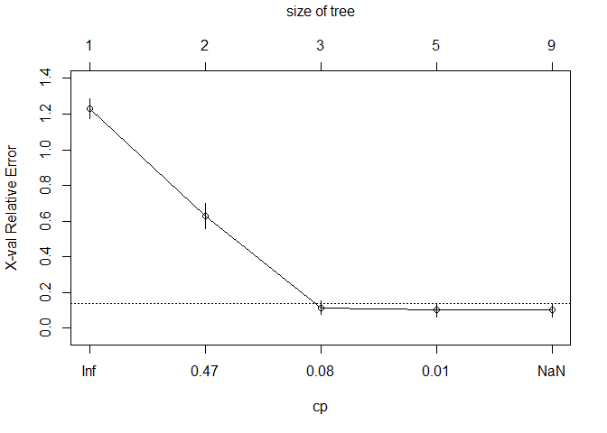
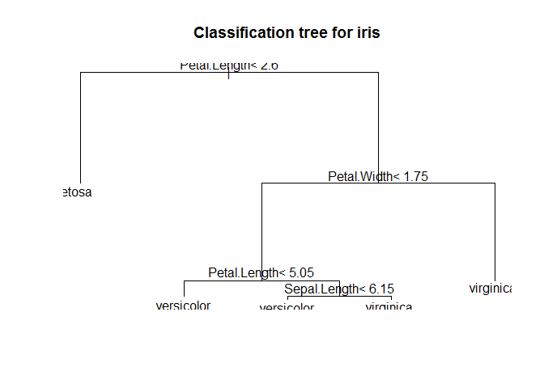

Decision Tree
================

Divid Data
----------

``` r
library(caret)
```

    Warning: package 'caret' was built under R version 3.4.4

    Loading required package: lattice

    Loading required package: ggplot2

``` r
idx <- createDataPartition(iris$Species, p=.7, list=F)
train <- iris[idx,]
test <- iris[-idx,]
table(train$Species)
```


        setosa versicolor  virginica 
            35         35         35 

Train model
-----------

##### rpart(formula, data= , method= , control= , na.action=na.rpart)

``` r
library(rpart)
tree <- rpart(Species ~ ., train)
tree
```

    n= 105 

    node), split, n, loss, yval, (yprob)
          * denotes terminal node

    1) root 105 70 setosa (0.33333333 0.33333333 0.33333333)  
      2) Petal.Length< 2.35 35  0 setosa (1.00000000 0.00000000 0.00000000) *
      3) Petal.Length>=2.35 70 35 versicolor (0.00000000 0.50000000 0.50000000)  
        6) Petal.Width< 1.75 37  3 versicolor (0.00000000 0.91891892 0.08108108) *
        7) Petal.Width>=1.75 33  1 virginica (0.00000000 0.03030303 0.96969697) *

Explore Tree
------------

``` r
plotcp(tree)
```


``` r
plot(tree, main="Classification tree for iris")
text(tree, cex=1)
```


predict test data
-----------------

``` r
tree_pred <- predict(tree, test, type="class")
head(tree_pred, 20)
```

             2          6          7          9         10         11 
        setosa     setosa     setosa     setosa     setosa     setosa 
            13         23         24         25         30         31 
        setosa     setosa     setosa     setosa     setosa     setosa 
            35         40         45         55         59         61 
        setosa     setosa     setosa versicolor versicolor versicolor 
            62         63 
    versicolor versicolor 
    Levels: setosa versicolor virginica

``` r
tree_pred_prob <- predict(tree, test, type="prob")
head(tree_pred_prob, 20)
```

       setosa versicolor  virginica
    2       1  0.0000000 0.00000000
    6       1  0.0000000 0.00000000
    7       1  0.0000000 0.00000000
    9       1  0.0000000 0.00000000
    10      1  0.0000000 0.00000000
    11      1  0.0000000 0.00000000
    13      1  0.0000000 0.00000000
    23      1  0.0000000 0.00000000
    24      1  0.0000000 0.00000000
    25      1  0.0000000 0.00000000
    30      1  0.0000000 0.00000000
    31      1  0.0000000 0.00000000
    35      1  0.0000000 0.00000000
    40      1  0.0000000 0.00000000
    45      1  0.0000000 0.00000000
    55      0  0.9189189 0.08108108
    59      0  0.9189189 0.08108108
    61      0  0.9189189 0.08108108
    62      0  0.9189189 0.08108108
    63      0  0.9189189 0.08108108

Evaluate a model
----------------

``` r
confusionMatrix(tree_pred, test$Species)
```

    Confusion Matrix and Statistics

                Reference
    Prediction   setosa versicolor virginica
      setosa         15          0         0
      versicolor      0         15         2
      virginica       0          0        13

    Overall Statistics
                                              
                   Accuracy : 0.9556          
                     95% CI : (0.8485, 0.9946)
        No Information Rate : 0.3333          
        P-Value [Acc > NIR] : < 2.2e-16       
                                              
                      Kappa : 0.9333          
     Mcnemar's Test P-Value : NA              

    Statistics by Class:

                         Class: setosa Class: versicolor Class: virginica
    Sensitivity                 1.0000            1.0000           0.8667
    Specificity                 1.0000            0.9333           1.0000
    Pos Pred Value              1.0000            0.8824           1.0000
    Neg Pred Value              1.0000            1.0000           0.9375
    Prevalence                  0.3333            0.3333           0.3333
    Detection Rate              0.3333            0.3333           0.2889
    Detection Prevalence        0.3333            0.3778           0.2889
    Balanced Accuracy           1.0000            0.9667           0.9333

``` r
printcp(tree)
```


    Classification tree:
    rpart(formula = Species ~ ., data = train)

    Variables actually used in tree construction:
    [1] Petal.Length Petal.Width 

    Root node error: 70/105 = 0.66667

    n= 105 

           CP nsplit rel error   xerror     xstd
    1 0.50000      0  1.000000 1.200000 0.058554
    2 0.44286      1  0.500000 0.742857 0.073189
    3 0.01000      2  0.057143 0.071429 0.031174

Control Decision Tree
---------------------

``` r
library(rpart)
tree_control <- rpart.control(xval=8, cp=-0.01, minsplit=1)
tree <- rpart(Species ~ ., train, control=tree_control)
tree
```

    n= 105 

    node), split, n, loss, yval, (yprob)
          * denotes terminal node

     1) root 105 70 setosa (0.33333333 0.33333333 0.33333333)  
       2) Petal.Length< 2.35 35  0 setosa (1.00000000 0.00000000 0.00000000) *
       3) Petal.Length>=2.35 70 35 versicolor (0.00000000 0.50000000 0.50000000)  
         6) Petal.Width< 1.75 37  3 versicolor (0.00000000 0.91891892 0.08108108)  
          12) Petal.Length< 4.95 34  1 versicolor (0.00000000 0.97058824 0.02941176)  
            24) Petal.Width< 1.65 33  0 versicolor (0.00000000 1.00000000 0.00000000) *
            25) Petal.Width>=1.65 1  0 virginica (0.00000000 0.00000000 1.00000000) *
          13) Petal.Length>=4.95 3  1 virginica (0.00000000 0.33333333 0.66666667)  
            26) Sepal.Length>=6.5 1  0 versicolor (0.00000000 1.00000000 0.00000000) *
            27) Sepal.Length< 6.5 2  0 virginica (0.00000000 0.00000000 1.00000000) *
         7) Petal.Width>=1.75 33  1 virginica (0.00000000 0.03030303 0.96969697)  
          14) Sepal.Length< 5.95 3  1 virginica (0.00000000 0.33333333 0.66666667)  
            28) Sepal.Length>=5.85 1  0 versicolor (0.00000000 1.00000000 0.00000000) *
            29) Sepal.Length< 5.85 2  0 virginica (0.00000000 0.00000000 1.00000000) *
          15) Sepal.Length>=5.95 30  0 virginica (0.00000000 0.00000000 1.00000000) *

Explore Tree
------------

``` r
plotcp(tree)
```

    Warning in sqrt(cp0 * c(Inf, cp0[-length(cp0)])): NaN이 생성되었습니다



``` r
plot(tree, main="Classification tree for iris")
text(tree, cex=1)
```


Evaluate a model
----------------

``` r
confusionMatrix(tree_pred, test$Species)
```

    Confusion Matrix and Statistics

                Reference
    Prediction   setosa versicolor virginica
      setosa         15          0         0
      versicolor      0         15         2
      virginica       0          0        13

    Overall Statistics
                                              
                   Accuracy : 0.9556          
                     95% CI : (0.8485, 0.9946)
        No Information Rate : 0.3333          
        P-Value [Acc > NIR] : < 2.2e-16       
                                              
                      Kappa : 0.9333          
     Mcnemar's Test P-Value : NA              

    Statistics by Class:

                         Class: setosa Class: versicolor Class: virginica
    Sensitivity                 1.0000            1.0000           0.8667
    Specificity                 1.0000            0.9333           1.0000
    Pos Pred Value              1.0000            0.8824           1.0000
    Neg Pred Value              1.0000            1.0000           0.9375
    Prevalence                  0.3333            0.3333           0.3333
    Detection Rate              0.3333            0.3333           0.2889
    Detection Prevalence        0.3333            0.3778           0.2889
    Balanced Accuracy           1.0000            0.9667           0.9333

``` r
printcp(tree)
```


    Classification tree:
    rpart(formula = Species ~ ., data = train, control = tree_control)

    Variables actually used in tree construction:
    [1] Petal.Length Petal.Width  Sepal.Length

    Root node error: 70/105 = 0.66667

    n= 105 

              CP nsplit rel error   xerror     xstd
    1  0.5000000      0  1.000000 1.214286 0.057482
    2  0.4428571      1  0.500000 0.685714 0.072923
    3  0.0142857      2  0.057143 0.085714 0.033978
    4  0.0071429      5  0.014286 0.114286 0.038836
    5 -0.0100000      7  0.000000 0.114286 0.038836

Perform pruning
---------------

``` r
tree$cptable
```

                CP nsplit  rel error     xerror       xstd
    1  0.500000000      0 1.00000000 1.21428571 0.05748199
    2  0.442857143      1 0.50000000 0.68571429 0.07292314
    3  0.014285714      2 0.05714286 0.08571429 0.03397821
    4  0.007142857      5 0.01428571 0.11428571 0.03883633
    5 -0.010000000      7 0.00000000 0.11428571 0.03883633

``` r
cp_xerror <- tree$cptable[,c('CP','xerror')]
cp_xerror
```

                CP     xerror
    1  0.500000000 1.21428571
    2  0.442857143 0.68571429
    3  0.014285714 0.08571429
    4  0.007142857 0.11428571
    5 -0.010000000 0.11428571

``` r
loc <- which.min(cp_xerror[,'xerror'])

tree_pruning <- prune(tree, cp=cp_xerror[loc,"CP"])
```

Explore Tree
------------

``` r
plot(tree_pruning, main="Classification tree for iris")
text(tree_pruning)
```


