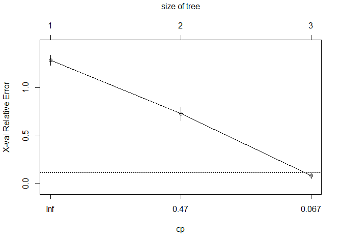
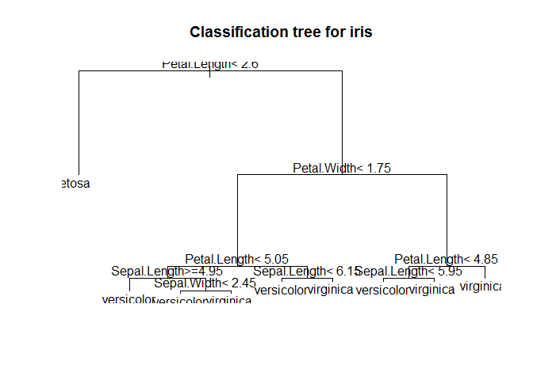

Decision Tree
================

Divid Data
----------

``` r
library(caret)
```

    Warning: package 'caret' was built under R version 3.4.4

    Loading required package: lattice

    Loading required package: ggplot2

``` r
idx <- createDataPartition(iris$Species, p=.7, list=F)
train <- iris[idx,]
test <- iris[-idx,]
table(train$Species)
```


        setosa versicolor  virginica 
            35         35         35 

Train model
-----------

##### rpart(formula, data= , method= , control= , na.action=na.rpart)

``` r
library(rpart)
tree <- rpart(Species ~ ., train)
tree
```

    n= 105 

    node), split, n, loss, yval, (yprob)
          * denotes terminal node

    1) root 105 70 setosa (0.33333333 0.33333333 0.33333333)  
      2) Petal.Length< 2.6 35  0 setosa (1.00000000 0.00000000 0.00000000) *
      3) Petal.Length>=2.6 70 35 versicolor (0.00000000 0.50000000 0.50000000)  
        6) Petal.Length< 4.95 37  3 versicolor (0.00000000 0.91891892 0.08108108) *
        7) Petal.Length>=4.95 33  1 virginica (0.00000000 0.03030303 0.96969697) *

Explore Tree
------------

``` r
plotcp(tree)
```



``` r
plot(tree, main="Classification tree for iris")
text(tree, cex=1)
```


predict test data
-----------------

``` r
tree_pred <- predict(tree, test, type="class")
head(tree_pred, 20)
```

             3          8         14         17         23         24 
        setosa     setosa     setosa     setosa     setosa     setosa 
            25         26         30         36         37         40 
        setosa     setosa     setosa     setosa     setosa     setosa 
            41         43         44         51         53         56 
        setosa     setosa     setosa versicolor versicolor versicolor 
            61         62 
    versicolor versicolor 
    Levels: setosa versicolor virginica

``` r
tree_pred_prob <- predict(tree, test, type="prob")
head(tree_pred_prob, 20)
```

       setosa versicolor  virginica
    3       1  0.0000000 0.00000000
    8       1  0.0000000 0.00000000
    14      1  0.0000000 0.00000000
    17      1  0.0000000 0.00000000
    23      1  0.0000000 0.00000000
    24      1  0.0000000 0.00000000
    25      1  0.0000000 0.00000000
    26      1  0.0000000 0.00000000
    30      1  0.0000000 0.00000000
    36      1  0.0000000 0.00000000
    37      1  0.0000000 0.00000000
    40      1  0.0000000 0.00000000
    41      1  0.0000000 0.00000000
    43      1  0.0000000 0.00000000
    44      1  0.0000000 0.00000000
    51      0  0.9189189 0.08108108
    53      0  0.9189189 0.08108108
    56      0  0.9189189 0.08108108
    61      0  0.9189189 0.08108108
    62      0  0.9189189 0.08108108

Evaluate a model
----------------

``` r
confusionMatrix(tree_pred, test$Species)
```

    Confusion Matrix and Statistics

                Reference
    Prediction   setosa versicolor virginica
      setosa         15          0         0
      versicolor      0         14         3
      virginica       0          1        12

    Overall Statistics
                                              
                   Accuracy : 0.9111          
                     95% CI : (0.7878, 0.9752)
        No Information Rate : 0.3333          
        P-Value [Acc > NIR] : 8.467e-16       
                                              
                      Kappa : 0.8667          
     Mcnemar's Test P-Value : NA              

    Statistics by Class:

                         Class: setosa Class: versicolor Class: virginica
    Sensitivity                 1.0000            0.9333           0.8000
    Specificity                 1.0000            0.9000           0.9667
    Pos Pred Value              1.0000            0.8235           0.9231
    Neg Pred Value              1.0000            0.9643           0.9062
    Prevalence                  0.3333            0.3333           0.3333
    Detection Rate              0.3333            0.3111           0.2667
    Detection Prevalence        0.3333            0.3778           0.2889
    Balanced Accuracy           1.0000            0.9167           0.8833

``` r
printcp(tree)
```


    Classification tree:
    rpart(formula = Species ~ ., data = train)

    Variables actually used in tree construction:
    [1] Petal.Length

    Root node error: 70/105 = 0.66667

    n= 105 

           CP nsplit rel error  xerror     xstd
    1 0.50000      0  1.000000 1.21429 0.057482
    2 0.44286      1  0.500000 0.74286 0.073189
    3 0.01000      2  0.057143 0.11429 0.038836

Control Decision Tree
---------------------

``` r
library(rpart)
tree_control <- rpart.control(xval=8, cp=-0.01, minsplit=1)
tree <- rpart(Species ~ ., train, control=tree_control)
tree
```

    n= 105 

    node), split, n, loss, yval, (yprob)
          * denotes terminal node

     1) root 105 70 setosa (0.33333333 0.33333333 0.33333333)  
       2) Petal.Length< 2.6 35  0 setosa (1.00000000 0.00000000 0.00000000) *
       3) Petal.Length>=2.6 70 35 versicolor (0.00000000 0.50000000 0.50000000)  
         6) Petal.Length< 4.95 37  3 versicolor (0.00000000 0.91891892 0.08108108)  
          12) Petal.Width< 1.65 33  0 versicolor (0.00000000 1.00000000 0.00000000) *
          13) Petal.Width>=1.65 4  1 virginica (0.00000000 0.25000000 0.75000000)  
            26) Sepal.Width>=3 1  0 versicolor (0.00000000 1.00000000 0.00000000) *
            27) Sepal.Width< 3 3  0 virginica (0.00000000 0.00000000 1.00000000) *
         7) Petal.Length>=4.95 33  1 virginica (0.00000000 0.03030303 0.96969697)  
          14) Petal.Length< 5.05 3  1 virginica (0.00000000 0.33333333 0.66666667)  
            28) Sepal.Length>=6.5 1  0 versicolor (0.00000000 1.00000000 0.00000000) *
            29) Sepal.Length< 6.5 2  0 virginica (0.00000000 0.00000000 1.00000000) *
          15) Petal.Length>=5.05 30  0 virginica (0.00000000 0.00000000 1.00000000) *

Explore Tree
------------

``` r
plotcp(tree)
```

    Warning in sqrt(cp0 * c(Inf, cp0[-length(cp0)])): NaN이 생성되었습니다


``` r
plot(tree, main="Classification tree for iris")
text(tree, cex=1)
```



Evaluate a model
----------------

``` r
confusionMatrix(tree_pred, test$Species)
```

    Confusion Matrix and Statistics

                Reference
    Prediction   setosa versicolor virginica
      setosa         15          0         0
      versicolor      0         14         3
      virginica       0          1        12

    Overall Statistics
                                              
                   Accuracy : 0.9111          
                     95% CI : (0.7878, 0.9752)
        No Information Rate : 0.3333          
        P-Value [Acc > NIR] : 8.467e-16       
                                              
                      Kappa : 0.8667          
     Mcnemar's Test P-Value : NA              

    Statistics by Class:

                         Class: setosa Class: versicolor Class: virginica
    Sensitivity                 1.0000            0.9333           0.8000
    Specificity                 1.0000            0.9000           0.9667
    Pos Pred Value              1.0000            0.8235           0.9231
    Neg Pred Value              1.0000            0.9643           0.9062
    Prevalence                  0.3333            0.3333           0.3333
    Detection Rate              0.3333            0.3111           0.2667
    Detection Prevalence        0.3333            0.3778           0.2889
    Balanced Accuracy           1.0000            0.9167           0.8833

``` r
printcp(tree)
```


    Classification tree:
    rpart(formula = Species ~ ., data = train, control = tree_control)

    Variables actually used in tree construction:
    [1] Petal.Length Petal.Width  Sepal.Length Sepal.Width 

    Root node error: 70/105 = 0.66667

    n= 105 

              CP nsplit rel error  xerror     xstd
    1  0.5000000      0  1.000000 1.14286 0.062348
    2  0.4428571      1  0.500000 0.61429 0.071984
    3  0.0285714      2  0.057143 0.11429 0.038836
    4  0.0142857      3  0.028571 0.10000 0.036515
    5  0.0071429      4  0.014286 0.10000 0.036515
    6 -0.0100000      6  0.000000 0.10000 0.036515

Perform pruning
---------------

``` r
tree$cptable
```

                CP nsplit  rel error    xerror       xstd
    1  0.500000000      0 1.00000000 1.1428571 0.06234797
    2  0.442857143      1 0.50000000 0.6142857 0.07198423
    3  0.028571429      2 0.05714286 0.1142857 0.03883633
    4  0.014285714      3 0.02857143 0.1000000 0.03651484
    5  0.007142857      4 0.01428571 0.1000000 0.03651484
    6 -0.010000000      6 0.00000000 0.1000000 0.03651484

``` r
cp_xerror <- tree$cptable[,c('CP','xerror')]
cp_xerror
```

                CP    xerror
    1  0.500000000 1.1428571
    2  0.442857143 0.6142857
    3  0.028571429 0.1142857
    4  0.014285714 0.1000000
    5  0.007142857 0.1000000
    6 -0.010000000 0.1000000

``` r
loc <- which.min(cp_xerror[,'xerror'])

tree_pruning <- prune(tree, cp=cp_xerror[loc,"CP"])
```

Explore Tree
------------

``` r
plot(tree_pruning, main="Classification tree for iris")
text(tree_pruning)
```


