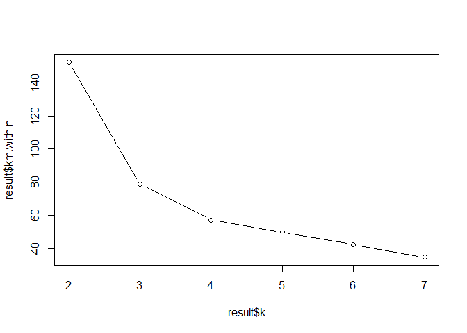
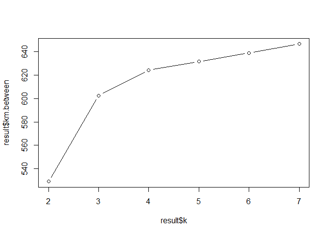
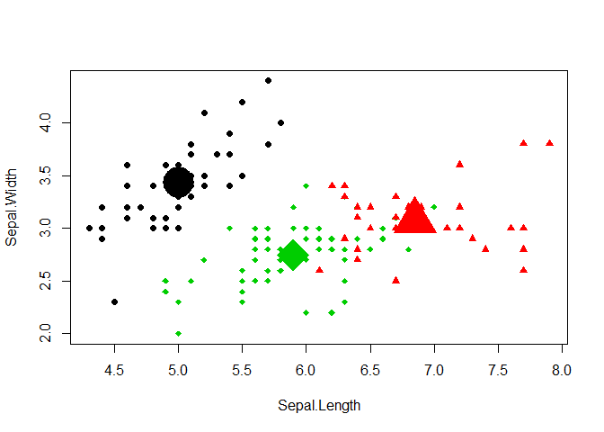

k-means
================

### Prepare Data

``` r
X <- iris[,1:4]
```

### Make a model

``` r
km.withiness <- c()
km.betweenss <- c()
k <- c()

for (i in 2:7) {
  set.seed(1)
  km <- kmeans(X, centers=i)
  k[i-1] <- i
  km.withiness[i-1] = km$tot.withinss # the within-cluster sum of squares
  km.betweenss[i-1] = km$betweenss # the between cluster sum of squares
}
```

``` r
result <- data.frame(k=k, km.within=km.withiness, km.between=km.betweenss)
result
```

    **   k km.within km.between
    ** 1 2 152.34795   529.0226
    ** 2 3  78.85144   602.5192
    ** 3 4  57.22847   624.1421
    ** 4 5  49.82228   631.5483
    ** 5 6  42.45606   638.9145
    ** 6 7  34.75675   646.6139

``` r
plot(result$k, result$km.within, type='b')
```



``` r
plot(result$k, result$km.between, type='b')
```



### Conclusion

``` r
set.seed(1)
km <- kmeans(X, 3)
```

``` r
km$centers
```

    **   Sepal.Length Sepal.Width Petal.Length Petal.Width
    ** 1     5.006000    3.428000     1.462000    0.246000
    ** 2     6.850000    3.073684     5.742105    2.071053
    ** 3     5.901613    2.748387     4.393548    1.433871

``` r
km$cluster
```

    **   [1] 1 1 1 1 1 1 1 1 1 1 1 1 1 1 1 1 1 1 1 1 1 1 1 1 1 1 1 1 1 1 1 1 1 1 1
    **  [36] 1 1 1 1 1 1 1 1 1 1 1 1 1 1 1 3 3 2 3 3 3 3 3 3 3 3 3 3 3 3 3 3 3 3 3
    **  [71] 3 3 3 3 3 3 3 2 3 3 3 3 3 3 3 3 3 3 3 3 3 3 3 3 3 3 3 3 3 3 2 3 2 2 2
    ** [106] 2 3 2 2 2 2 2 2 3 3 2 2 2 2 3 2 3 2 3 2 2 3 3 2 2 2 2 2 3 2 2 2 2 3 2
    ** [141] 2 2 3 2 2 2 3 2 2 3

``` r
km$size
```

    ** [1] 50 38 62

``` r
plot(X[,1:2], col=km$cluster,
     pch=ifelse(km$cluster==1, 16,
                ifelse(km$cluster==2, 17, 18)))
points(km$centers, col=1:3,pch=16:18, cex=5)
```


